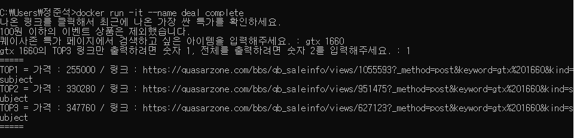

# Quasar Zone Price Finder

Quasar Zone Price Finder is a program that uses Selenium to find the best prices for user-inserted keywords on the [Quasar Zone community's](https://quasarzone.com/) special deals page.

- [Features](#Features)
- [Installation](#Installation)
- [Usage](#Usage)

## Features

- Easy setup using Docker
- Run Selenium to avoid anti-scraping measures
- Find the best price in [QZ's](https://quasarzone.com/) Special Deals page
- print TOP3 links or all results

## Installation

```sh
docker build -t QZP .
```

## Usage

```sh
docker run -it --name deal QZP
```

1. After running the program, input the desired keyword.
2. The program will search for the keyword and provide output options  
   1: Display the top 3 lowest prices and links  
   2: Display all available deals and links


